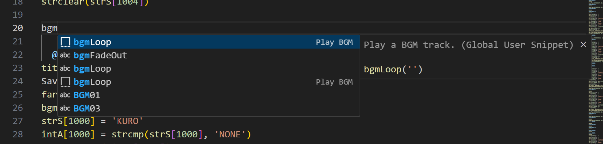

# RL (RealLive) Scripting Extension
This extension adds syntax highlighting to '.org' and '.utf' files used by the RealLive Visual Novel Engine! This extension strives to make it easier (especially for me) to read scripts for RealLive.

# Features
This extension has
- Syntax Highlighting  

- Snippets

